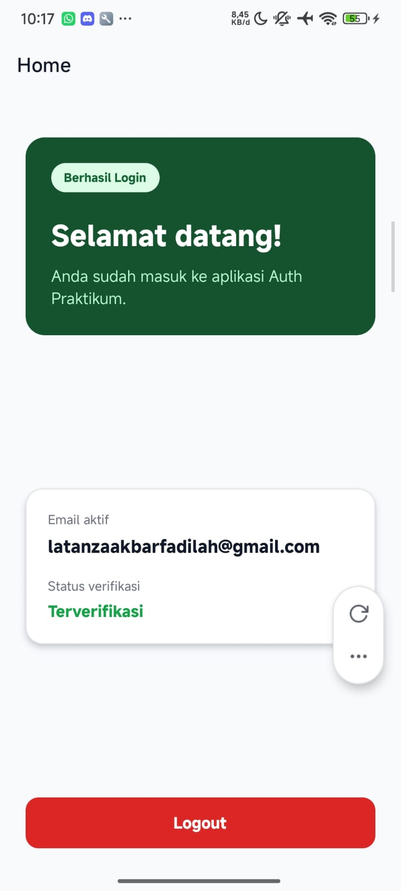
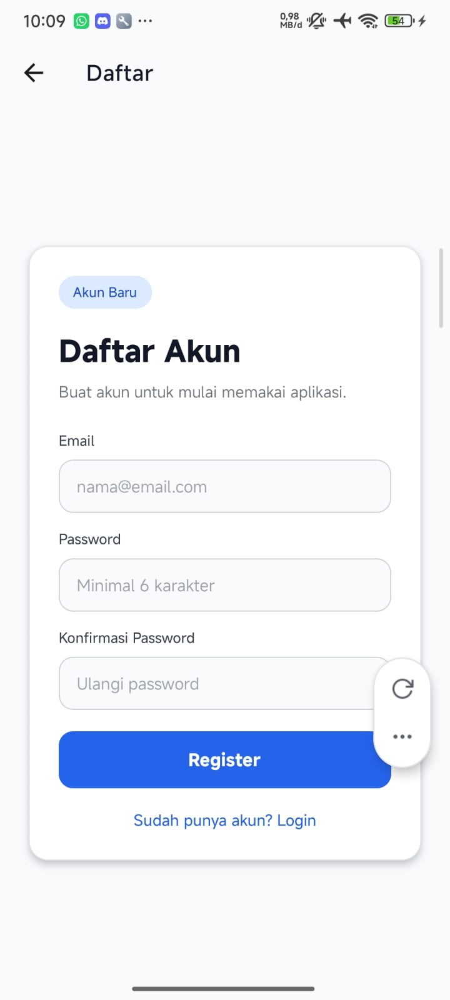
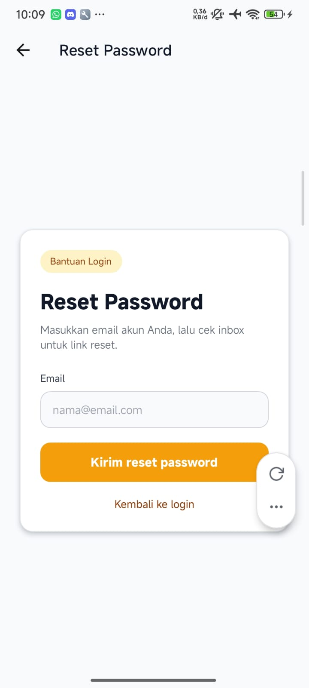

# Auth-Praktikum

## Informasi Mahasiswa
- **Nama** : Latanza Akbar Fadilah
- **NIM** : 2410501004  
- **Kelas** : B  

---

## Deskripsi
Aplikasi autentikasi berbasis React Native (Expo) yang terintegrasi dengan Firebase Authentication, menyediakan fitur login aman menggunakan email/password, dukungan biometrik, verifikasi email, reset password, serta sistem auto logout saat user tidak aktif.

---

## Dependencies

### Core
- expo (~54.0.33)
- react (19.1.0)
- react-native (0.81.5)
- react-native-web (^0.21.0)

### Navigation
- @react-navigation/native (^7.2.2)
- @react-navigation/native-stack (^7.14.12)
- react-native-screens (~4.16.0)
- react-native-safe-area-context (~5.6.0)

### Authentication & Backend
- firebase (^12.12.1)

### Storage & Security
- expo-secure-store (~15.0.8)
- @react-native-async-storage/async-storage (2.2.0)

### Biometrics
- expo-local-authentication (~17.0.8)

### Utilities
- expo-status-bar (~3.0.9)

### Dev Tools
- prettier (^3.8.3)

---

## Fitur

### Authentication
- Login & Register menggunakan Email/Password (Firebase Authentication)
- Verifikasi email setelah proses registrasi
- Reset password melalui email (Firebase Password Recovery)

### Biometric Login
- Login menggunakan fingerprint / face unlock (sesuai device)
- Menggunakan `expo-local-authentication`

### Security
- Token disimpan aman menggunakan `expo-secure-store`
- Protected routes (akses Home hanya untuk user login)

### Auto Logout
- Logout otomatis setelah 5 menit idle
- Menggunakan `AppState` + timer

---

## Screenshots
<div style="display: flex; flex-direction: row; gap: 10px;">
  
  
  
  
</div>
<br>

---

## Video Demo
- [Klik di sini untuk menonton Video Demo Aplikasi (Youtube)](https://youtu.be/zsZ1dDxjuEA)

---
## Cara Menjalankan

### 1. Clone Repository & Install Dependencies
Pertama, clone repository ini ke komputer Anda, masuk ke dalam folder project, dan install semua dependensinya.
```bash
git clone <URL_REPOSITORY>
```

```bash
cd auth-praktikum
```

```bash
npm install
```

### 2. Konfigurasi Firebase API
Aplikasi ini membutuhkan konfigurasi Firebase agar fitur autentikasi dapat berjalan.
1. Buat project baru di [Firebase Console](https://console.firebase.google.com/).
2. Aktifkan **Authentication** (Email/Password provider).
3. Daftarkan aplikasi Web di Firebase untuk mendapatkan config keys.
4. Buka file `src/config/firebase.js` di dalam project ini.
5. Ganti nilai konfigurasi bawaan dengan kunci Firebase milik Anda:
   ```javascript
   const firebaseConfig = {
     apiKey: "YOUR_API_KEY",
     authDomain: "YOUR_AUTH_DOMAIN",
     projectId: "YOUR_PROJECT_ID",
     storageBucket: "YOUR_STORAGE_BUCKET",
     messagingSenderId: "YOUR_MESSAGING_SENDER_ID",
     appId: "YOUR_APP_ID"
   };
   ```

### 3. Menjalankan Aplikasi
Setelah dependensi terinstall dan Firebase terkonfigurasi, jalankan server pengembangan Expo:
```bash
npx expo start
```
- Tekan `a` untuk membuka di Android Emulator.
- Tekan `i` untuk membuka di iOS Simulator.
- Atau scan QR code menggunakan aplikasi **Expo Go** di HP fisik Anda.